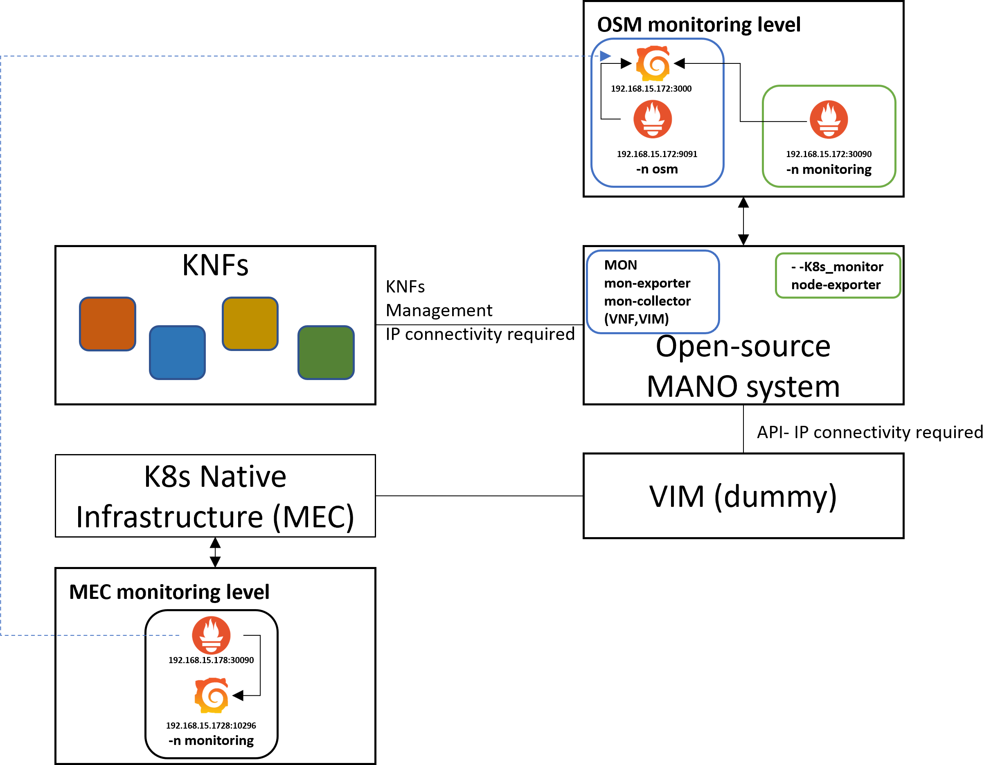
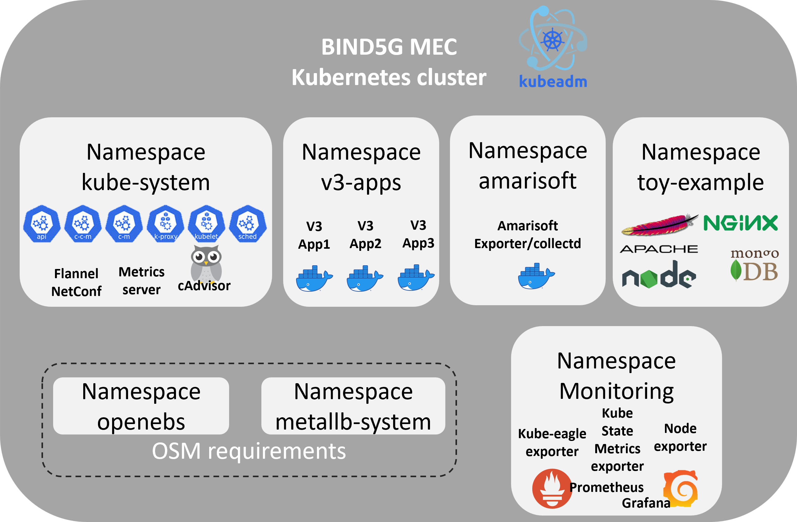
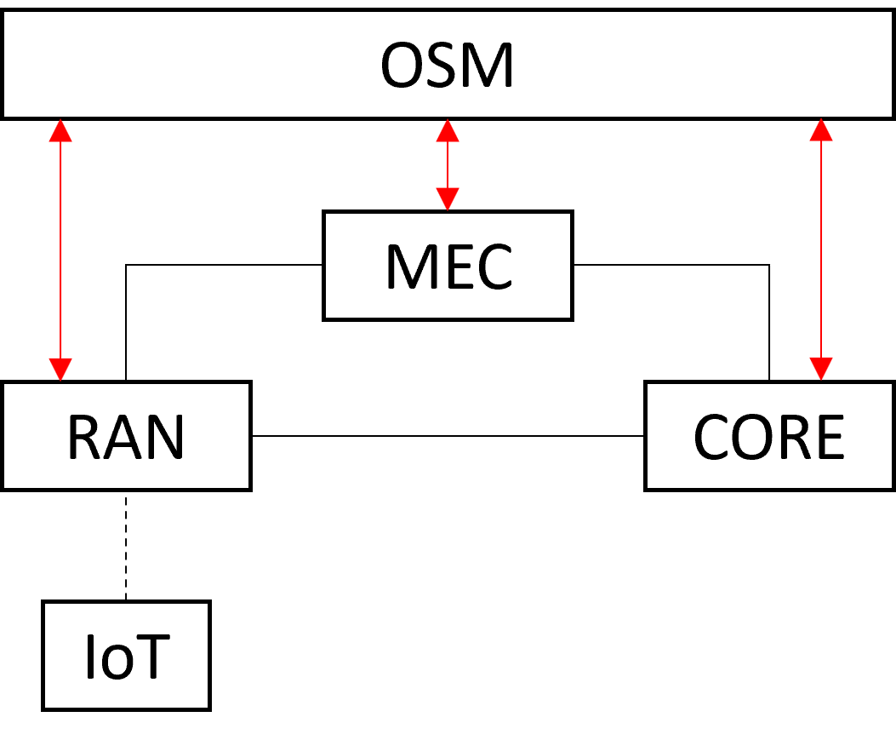

# MEC Edge Site on Kubernetes

[](https://github.com/mdalgitsis/mec-edge-site/actions/workflows/validate.yml)
[](LICENSE)
[](https://kubernetes.io)
[](https://prometheus.io)
[](https://osm.etsi.org)
[](api/edge-api.yaml)

A complete, buildable **Multi-access Edge Computing (MEC) site**: a Kubernetes cluster bootstrapped with kubeadm,
a full Prometheus observability stack spanning infrastructure, applications and the **5G radio network**, ETSI
OSM integration for orchestrating Kubernetes Network Functions, and a REST API for driving the whole thing
remotely.

Built for the **BIND5G** project (Basque Industry 5G) at **Vicomtech**, where the goal was an Industry 4.0 edge
infrastructure that is fully programmable, observable and orchestrated.

## What makes this different

A MEC site is only useful if you can *see* it. The interesting part here is that observability reaches all the
way down into the mobile network: alongside the usual node and pod metrics, the cluster scrapes a live
**Amarisoft LTE/NR EPC and eNB/gNB**, so radio-layer measurements — per-UE throughput, MCS, PUSCH/PUCCH SNR and
CQI — land in the same Prometheus as your container metrics. Correlating an application's latency with the radio
conditions of the UE that caused it is the whole point of an edge site, and it is exactly what most Kubernetes
monitoring stacks cannot do.



## Documentation

The guide is written to be followed start to finish on a clean Ubuntu machine, bare-metal or VM.

| # | Guide | Covers |
|---|---|---|
| 1 | **[Kubernetes cluster](docs/01-kubernetes-cluster.md)** | Container runtime, kubelet/kubeadm/kubectl, `kubeadm init`, CNI, the extra configuration OSM integration requires |
| 2 | **[Running workloads](docs/02-running-workloads.md)** | Deploying Apache, MongoDB and a replicated Node.js app as worked examples |
| 3 | **[Monitoring](docs/03-monitoring.md)** | metrics-server, kube-prometheus-stack, kube-eagle, and writing ServiceMonitors for your own applications |
| 4 | **[Amarisoft RAN monitoring](docs/04-amarisoft-monitoring.md)** | The Amarisoft remote WebSocket API, the collectd exporter, running it in-cluster, and the metrics it yields |
| 5 | **[OSM integration](docs/05-osm-integration.md)** | Installing OSM, registering the cluster as a VIM, and onboarding KNFs |

## Repository layout

```
docs/           The five-part build guide, with diagrams
api/            Edge-API OpenAPI 3.0 specification
manifests/      MetalLB, metrics-server, Prometheus jobs, Amarisoft exporter deployment
examples/       Sample workloads and exporter values used throughout the guide
exporters/      The per-UE Amarisoft collectd plugins written for this project
```

## The Edge-API

A REST API that sits between a higher-level NaaS API and the cluster, so experiments can be deployed and managed
remotely without handing out kubeconfigs. That northbound NaaS API — which drives radio, core and edge together
and delegates the Kubernetes half to this one — is in
**[mdalgitsis/BIND5G](https://github.com/mdalgitsis/BIND5G)**. **OpenAPI 3.0, version 1.0.2, 32 paths, 46 operations** —
[`api/edge-api.yaml`](api/edge-api.yaml), with the full endpoint reference in [`api/README.md`](api/README.md).

| Group | What it does |
|---|---|
| **`/cluster/*`** | Read-only inventory across all namespaces — nodes and node status, pods, deployments, services, ServiceMonitors, ResourceQuotas, LimitRanges |
| **`/namespaces/*`** | Full lifecycle for namespaces, pods (including logs), deployments, services, ServiceMonitors, quotas and limit ranges |
| **`/kns/*`** | Kubernetes Network Services — create, list and delete Helm-chart KNFs through **ETSI OSM**, plus `day2actions` |

The part that makes it more than a kubectl wrapper is **scaling**. Deployments expose `scaleHorizontal` (replica
count) and `scaleVertical` (per-container CPU and memory), which is what closes the loop with the monitoring
stack: an external optimiser reads the Prometheus metrics gathered above — including the radio-layer ones — and
reshapes workloads in response.

```http
PATCH /namespaces/default/deployments/nginx-deployment/nginx/scaleVertical
Content-Type: application/json

{
  "container_resource_requests_cpu_value":    "50m",
  "container_resource_requests_memory_value": "32Mi",
  "container_resource_limits_cpu_value":      "100m",
  "container_resource_limits_memory_value":   "64Mi",
  "deployment_selector": {}
}
```

### Reuse outside this project

A 19-path predecessor of this specification — the BIND5G **Scaling API** — was later reused as the Kubernetes
actuator in a *separate* project: Team Pedraforca's entry at the ETSI/LF MEC Hackathon 2022, and the IEEE CSCN
2022 demo paper that came out of it ([arXiv:2211.13995](https://arxiv.org/abs/2211.13995)). That is different
work by a different team, with its own goals and its own code in
[`RasoulNik/mec_sandbox`](https://github.com/RasoulNik/mec_sandbox); it is noted here only because it is where
this API's scaling endpoints were first exercised.

The specification is the deliverable. The swagger-codegen Python client and Flask server that were generated from
it have been removed — they were machine output, they outnumbered the hand-written files five to one, and
[`api/README.md`](api/README.md) shows how to regenerate either on demand.

## Architecture

The cluster is split into namespaces by concern, with monitoring components alongside the workloads they observe:



And the place of this site within the wider BIND5G architecture — red arrows show what OSM manages and
orchestrates:



## Known limitations

- **The Edge-API defines no authentication.** All 46 operations, including namespace deletion and workload
  scaling, are unauthenticated; the design assumed a private network behind the BIND5G NaaS API. See
  [`api/README.md`](api/README.md).
- The guide targets the Kubernetes, Prometheus-operator and OSM versions current in 2022; manifest API versions
  and command output have moved on.
- The per-UE collectd plugins are Python 2.

## Status

This documents work carried out in 2022–23 and is preserved as a reference rather than actively maintained.
Versions have moved on — in particular `kubeadm`, the Prometheus operator CRDs and OSM have all changed since —
so treat command output and manifest API versions as illustrative. The architecture and the approach are the
durable parts.

## Acknowledgements

Developed under the **BIND5G** project at **[Vicomtech](https://www.vicomtech.org/)**. The wider project work —
the NaaS API, Thanos cross-site federation and the WireGuard federation this site sat inside — is in
[mdalgitsis/BIND5G](https://github.com/mdalgitsis/BIND5G).

The Amarisoft Prometheus exporter this work builds on is
**[amarisoft-prometheus-exporter-collectd](https://github.com/core-ncsrd/amarisoft-prometheus-exporter-collectd)**
by Andreas Foteas, NCSR "Demokritos" (MediaNetLab). That project is not redistributed here — it carries no
license — so [`exporters/amarisoft`](exporters/amarisoft) contains only the per-UE plugins written for BIND5G,
with instructions for combining them with upstream.

Amarisoft's LTEENB and LTEMME are commercial products; this repository monitors them through their documented
remote API and contains none of their software.

## License

[Apache License 2.0](LICENSE), matching the license declared in the Edge-API specification.
