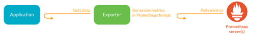
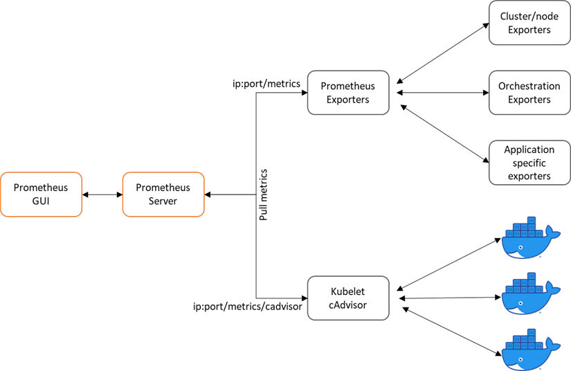
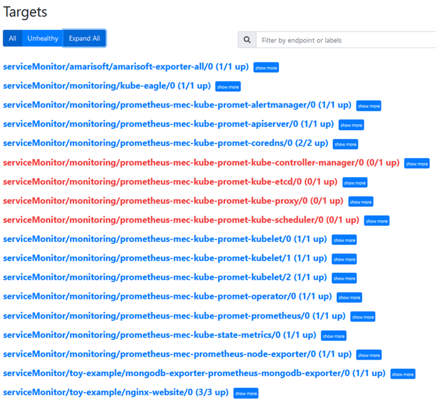

# Monitor a K8s cluster

To monitor a K8s cluster and its running applications there are native and third party solutions. For example metrics-server lies under the native solutions while Prometheus is an open-source monitoring tool, which can be installed and deployed inside the cluster. 

## Native monitoring tools (metrics-server)

Metrics-server is a scalable, efficient source of container resource metrics for Kubernetes built-in autoscaling pipelines.

Metrics-server collects resource metrics from kubelets and exposes them in Kubernetes apiserver through [Metrics API](https://github.com/kubernetes/metrics) for use by [Horizontal Pod Autoscaler](https://kubernetes.io/docs/tasks/run-application/horizontal-pod-autoscale/) and [Vertical Pod Autoscaler](https://github.com/kubernetes/autoscaler/tree/master/vertical-pod-autoscaler/). Metrics API can also be accessed by `kubectl top`, making it easier to debug autoscaling pipelines.

 - [ ] Apply metrics-server in the cluster

	   kubectl apply -f https://github.com/kubernetes-sigs/metrics-server/releases/latest/download/components.yaml

 - [ ] Check metrics-server in the K8s cluster

	   kubectl get pods -n kube-system

 - [ ] If metrics-server is not working properly we have to edit the
       Deployment

	   kubectl edit deployment/my-nginx -n kube-system 

 - [ ] and add the `--kubelet-insecure-tls` line in the Deployment

	    spec:
	    
	    containers:
	    
	    - args:
	    
	    - --cert-dir=/tmp
	    
	    - --secure-port=4443
	    
	    - --kubelet-preferred-address-types=InternalDNS,InternalIP,ExternalDNS,ExternalIP,Hostname
	    
	    - --kubelet-insecure-tls 
	    
	    - --kubelet-use-node-status-port
    
        
Another way which is preferred is to configure the components.yaml file from the manifest, but first the initial metrics-server manifest must be deleted

 - [ ] Delete the metrics-server manifest file and then get (download) the file to your host machine

	   kubectl delete -f https://github.com/kubernetes-sigs/metrics-server/releases/latest/download/components.yaml
	   wget https://github.com/kubernetes-sigs/metrics-server/releases/latest/download/components.yaml

 - [ ] Open it with an IDE program. Edit the file by adding
       `--kubelet-insecure-tls` in the Deployment kind and Save it.

 - [ ] Apply it in the cluster:

	   kubectl apply -f components.yaml

 - [ ] Check whether the metrics-server app is installed by running the
       following command:

	   kubectl get pods --all-namespaces | grep metrics-server

 - [ ] Once metrics-server is properly installed, we can use it with

	   kubectl top pod
	   kubectl top node

This will show us metrics from all the Pods in the *default* Namespace and metrics from the Nodes.

## Monitoring with a Prometheus Server

A Prometheus server can be installed either as a binary or as a container. In a K8s cluster the easiest and most efficient way is through helm charts. Helm charts are a collection of Kubernetes manifest files, which make the installation of an application simpler.
[kube-prometheus stack](https://github.com/prometheus-operator/kube-prometheus) is a collection of Kubernetes manifests, Grafana dashboards, and Prometheus rules combined with documentation and scripts to provide easy to operate end-to-end Kubernetes cluster monitoring with [Prometheus](https://prometheus.io/) using the [Prometheus Operator](https://github.com/prometheus-operator/prometheus-operator).

 > **Note:** This chart was formerly named `prometheus-operator` chart, now renamed to more clearly reflect that it installs the `kube-prometheus` project stack, within which Prometheus Operator is only one component.

 - [ ] Installing Helm from binary releases:

	   wget https://get.helm.sh/helm-v3.6.2-linux-amd64.tar.gz
	   tar -zxvf helm-v3.6.2-linux-amd64.tar.gz
	   sudo mv linux-amd64/helm /usr/local/bin/helm
    

 - [ ] From there, we should be able to run some helm commands and add
       the stable repo:

	   helm help
	   helm repo add stable https://charts.helm.sh/stable
	   helm repo update
	   helm repo list
	   helm list

More installation methods of helm can be found [here](https://helm.sh/docs/intro/install/) .

Back to Prometheus kube-stack installation process, we will get the helm repository and install it.

 - [ ] Get Repo Info

	   helm repo add prometheus-community https://prometheus-community.github.io/helm-charts
	   helm repo update
	   helm install prometheus-mec prometheus-community/kube-prometheus-stack -n monitoring --create-namespace --set prometheus.service.type="LoadBalancer"

We notice that with the `helm install` command we can pass switches to configure the installation. With `-n monitoring` we declare to apply the prometheus stack in the *monitoring* Namespace, which we actually create it with the `--create-namespace` command. Also, we can set the Service type of Prometheus server as *LoadBalancer*. 

> **Note:** There are four types of Kubernetes Services — *ClusterIP, NodePort, LoadBalancer* and *ExternalName*. The type property in the Service's spec determines how the service is exposed to the network.

To change the Service from one type to another, for example from *LoadBalancer* to *NodePort*, we can upgrade the helm chart with `helm upgrade` command:

 - [ ] Upgrade helm chart

	   helm upgrade prometheus-mec prometheus-community/kube-prometheus-stack -n monitoring --set prometheus.service.type="NodePort" --set grafana.service.type="NodePort"

 - [ ] Check status with

	   kubectl --namespace monitoring get pods -l "release=prometheus-mec"

 - [ ] Obtain all the Kubernetes kinds in the *monitoring* Namespace with:

	   kubectl get all -n monitoring 

To find more information on how to access the GUI of Prometheus and Grafana, we can focus only on `kubectl get service` command and check the collumns TYPE, CLUSTER-IP and PORTS.

 - [ ] List services of *monitoring* Namespace

	   kubectl get service -n monitoring 

> **Note:** As we mentioned earlier there are four types of Services and one of the is *ClusterIP*. The collumn though CLUSTER-IP simply denotes the ip address of the Service regardless the Service type

> **Note:** If the Service type of a Pod or Deployment is *ClusterIP* we can browse this application through the hosts browser. In case we access the cluster remotely for example with ssh and floating ips, we have to change the type to *NodePort*, and to browse the application we use the floating ip and the *NodePort* port.

> **Note:** The credentials to access the Grafana GUI are username: admin and password: prom-operator

## Expose metrics to Prometheus with kube-eagle exporter

[Kube-eagle](https://github.com/cloudworkz/kube-eagle) is a prometheus exporter which exports various metrics of kubernetes pod resource requests, limits and it's actual usages. It was created with the purpose to provide a better overview of your kubernetes cluster resources, so that you can optimize the resource allocation. 
> **Note:** Metrics-server is a prerequisite for Kube Eagle to work. 

By using helm charts as in the Prometheus case we simplify the deployment of kube-eagle exporter.

 - [ ] Add helm repo and install it in *monitoring* Namespace

	   helm repo add kube-eagle https://raw.githubusercontent.com/cloudworkz/kube-eagle-helm-chart/master
	   helm repo update    
	   helm install kube-eagle kube-eagle/kube-eagle -n monitoring --create-namespace
	   helm upgrade kube-eagle kube-eagle/kube-eagle -n monitoring --set serviceMonitor.create=true --set serviceMonitor.releaseLabel=prometheus-mec

> **Note:** Check how Prometheus server auto-discovers kube-eagle exporter with the *release label prometheus-mec* in the ServiceMonitor section

Optionally, another way to configure the installation of a helm chart is through the values.yaml file. 
See how the values.yaml file looks like with the `helm show values` command following with the reponame and chart name:

    helm show values kube-eagle/kube-eagle

We can use the values.yaml file either with the `helm install` or with the `helm upgrade` command.

 - [ ] Run again the `helm show values` command  and save the output
       into a yaml file

	   helm show values kube-eagle/kube-eagle > values.yaml 

 - [ ] Edit the values.yaml file and apply it again in the cluster

	   helm upgrade kube-eagle kube-eagle/kube-eagle -n monitoring -f values.yaml

## Deploy Prometheus exporters for the applications of *toy-example* namespace

To monitor the mongodb application we deployed on the *toy-example* Namespace, we need application-specific Prometheus exporters. The Prometheus exporters are intermidiate programs which help us to expose the desired metrics to Prometheus server. These exporters translate the application metrics to Prometheus format and expose the metrics to endpoints. Then Prometheus server with the ServiceMonitor feature discovers the exporter and scrapes its endpoint to collect the metrics. A list of already implemented exporters can be found [here](https://prometheus.io/docs/instrumenting/exporters/) and the figure illustrates how Prometheus is scraping the exporters

 > **Note:** There are exporter installations with helm charts which makes it easier to be deployed. If an exporter does not come with a helm chart, we have to deploy and configure mannually the exporter in the cluster as we will see later on.

Lets add a mongodb exporter through a helm chart.

 - [ ] Show and save mongodb exporter´s value.yaml file
 
       helm show values prometheus-community/prometheus-mongodb-exporter > values.yaml
 
 - [ ] Edit it as follows

	    mongodb:
	      uri: "mongodb://mongodb-service:27017"
	    
	    serviceMonitor:
	      namespace: toy-example
	      additionalLabels:
	        release: prometheus-mec

 - [ ] Install it by passing the value.yaml file

	   helm install mongodb-exporter prometheus-community/prometheus-mongodb-exporter -f values.yaml --namespace=toy-example

Now, let us deploy an NGINX application with an NGINX exporter as a side-car container and deploy it mannualy in the cluster in the Namespace *toy-example*. 

 - [ ] Create the Deployment kind manifest file

	    apiVersion: apps/v1
	    kind: Deployment
	    metadata:
	      name: nginx-website
	      namespace: toy-example
	      labels:
	        app: website
	    spec:
	      replicas: 3
	      selector:
	        matchLabels:
	          app: website
	      template:
	        metadata:
	          labels:
	            app: website
	        spec:
	          containers:
	          - env:
	            image: quay.io/igou/igou.io-nginx:latest
	            imagePullPolicy: Always
	            name: igou-website
	            ports:
	            - containerPort: 80
	            livenessProbe:
	              httpGet:
	                scheme: HTTP
	                path: /
	                port: 80
	              initialDelaySeconds: 30
	              timeoutSeconds: 30
	            volumeMounts:
	            - mountPath: /etc/nginx/conf.d/nginx-status.conf
	              name: nginx-status-conf
	              readOnly: true
	              subPath: nginx.status.conf
	          - name: nginx-exporter
	            image: 'nginx/nginx-prometheus-exporter:0.3.0'
	            args:
	              - '-nginx.scrape-uri=http://localhost:8090/nginx_status'
	            ports:
	              - name: nginx-ex-port
	                containerPort: 9113
	                protocol: TCP
	            imagePullPolicy: Always
	          volumes:
	          - configMap:
	              defaultMode: 420
	              name: nginx-status-conf
	            name: nginx-status-conf

 - [ ] Create the Service kind manifest file

	    apiVersion: v1
	    kind: Service
	    metadata:
	      labels:
	        app: website
	      name: nginx-website
	      namespace: toy-example
	    spec:
	      ports:
	      - port: 80
	        protocol: TCP
	        targetPort: 80
	        name: http
	      - port: 9113
	        protocol: TCP
	        targetPort: 9113
	        name: metrics
	      selector:
	        app: website
	      sessionAffinity: None
	      type: ClusterIP

 - [ ] Create the ConfigMap kind manifest file

	    apiVersion: v1
	    data:
	      nginx.status.conf: |
	        server {
	            listen       8090 default_server;
	            location /nginx_status {
	                stub_status;
	                access_log off;
	            }
	        }
	    kind: ConfigMap
	    metadata:
	      name: nginx-status-conf
	      namespace: toy-example

 - [ ] Create the ServiceMonitor kind manifest file

	    apiVersion: monitoring.coreos.com/v1
	    kind: ServiceMonitor
	    metadata:
	      name: nginx-website
	      namespace: toy-example
	      labels:
	        release: prometheus-mec
	    spec:
	      selector:
	        matchLabels:
	          app: website
	      endpoints:
	      - port: metrics
	        interval: 30s

 > **Note:** Check how we connect the exporter with the Prometheus server with the additional label, *release: prometheus-mec* under the metadata section

With `---` inside a yaml file we can separete Kubernetes kinds and we can apply them by calling only one file. For example as we can see below in the same yaml manifest file igou_deployment_service.yaml, we have the Deployment and the Service kind.

    apiVersion: apps/v1
    kind: Deployment
    metadata:
      name: nginx-website
      namespace: toy-example
      labels:
        app: website
    spec:
      replicas: 3
      selector:
        matchLabels:
          app: website
      template:
        metadata:
          labels:
            app: website
        spec:
          containers:
          - env:
            image: quay.io/igou/igou.io-nginx:latest
            imagePullPolicy: Always
            name: igou-website
            ports:
            - containerPort: 80
            livenessProbe:
              httpGet:
                scheme: HTTP
                path: /
                port: 80
              initialDelaySeconds: 30
              timeoutSeconds: 30
            volumeMounts:
            - mountPath: /etc/nginx/conf.d/nginx-status.conf
              name: nginx-status-conf
              readOnly: true
              subPath: nginx.status.conf
          - name: nginx-exporter
            image: 'nginx/nginx-prometheus-exporter:0.3.0'
            args:
              - '-nginx.scrape-uri=http://localhost:8090/nginx_status'
            ports:
              - name: nginx-ex-port
                containerPort: 9113
                protocol: TCP
            imagePullPolicy: Always
          volumes:
          - configMap:
              defaultMode: 420
              name: nginx-status-conf
            name: nginx-status-conf
    
    ---
    
    apiVersion: v1
    kind: Service
    metadata:
      labels:
        app: website
      name: nginx-website
      namespace: toy-example
    spec:
      ports:
      - port: 80
        protocol: TCP
        targetPort: 80
        name: http
      - port: 9113
        protocol: TCP
        targetPort: 9113
        name: metrics
      selector:
        app: website
      sessionAffinity: None
      type: ClusterIP

 - [ ] Apply this manifest file to the cluster with

	   kubectl apply -f igou_deployment_service.yaml

 - [ ] Apply the configmap manifest file

	   kubectl apply -f igou_cm.yaml

 - [ ] Apply the servicemonitor  manifest file

	   kubectl apply -f igou_sm.yaml

## Monitoring general architectural flow in a K8s cluster with Prometheus

The figure below demonstrates the way metrics are exposed to a Prometheus server running in a K8s cluster

The exposed metrics can be classified into two categories

 - K8s cluster metrics 
	 - Metrics for monitoring K8s nodes such as classic sysadmin level metrics (through [node-exporter](https://docs.splunk.com/observability/gdi/prometheus-node/prometheus-node.html) or [kube-eagle](https://github.com/cloudworkz/kube-eagle)) cpu, load, memory, disk, etc.. 
	 - Orchestration level metrics (through [kube-state-metrics](https://github.com/kubernetes/kube-state-metrics/tree/master/docs)) like deployments, pods, replica status, nodes 
	 - Metrics for monitoring containers: Container resource level metrics (through [kubelet/cadvisor](https://github.com/google/cadvisor/blob/master/docs/storage/prometheus.md) and [kube-eagle](https://github.com/cloudworkz/kube-eagle)   
 - Specific application metrics
	 - Metrics exposed by specific exporters, which are either running a a side-car containers alongside the main application´s container or as a seperate deployment kind

  The figure below shows the list of the endpoints Prometheus server is scraping. Check the kube-eagle exporter, the NGINX exporter, the mongodb exporter, the node exporter from prometheus-stack, the kube-state-metrics from prometheus stack and kubelet/cadvisor a Kubernetes control plane component which is exposing container and hardware statistics as Prometheus metrics out of the box.
  
  

> **Note:** The Amarisoft exporter has not been deployed yet. This snapshot has been taken at the end of the tutorial. Thus, on the next section we will deploy the Amarisoft exporter and configure it to appear in the targets list. 

