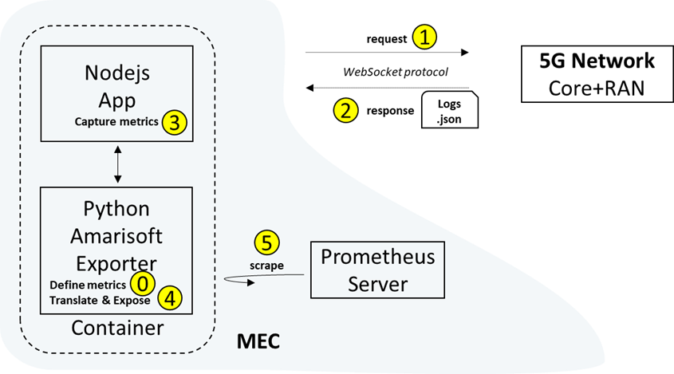
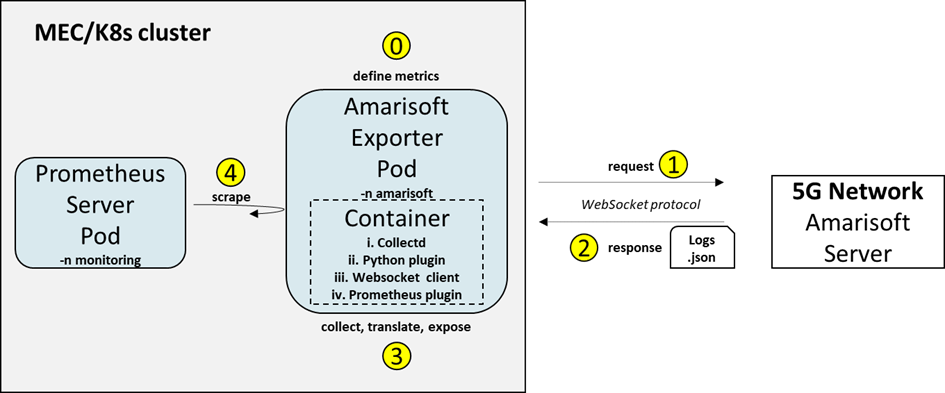

# Monitor an Amarisoft mobile network server

On behalf of BIND5G project the large-scale 5G Amarisoft network is exploited. The large-scale 5G Amarisoft network consists of the core, RAN and UE parts, all running in the same PC as a softwarized solution. Smartphones with 5G sim cards can also be connected to this 5G network. Also, part of the Amarisoft solution are a remote API to provide communication with the RAN and core part, and a GUI to monitor and visualize the status and performance of the network. As a result, there are three ways to monitor the 5G Amarisoft network:

 - Remote Api
 - Amarisoft server GUI
 - Amarisoft monitoring exporter

Bofore we start the monitoring phase, the Amarisoft server must be turned on and be configured either in Non-stand alone (NSA) or stand alone (SA) mode.

 - [ ] Connect to Amarisoft large scale network with ssh from a local
       terminal:

	   ssh user@192.168.15.209
	   password: *****
	   sudo su

 - [ ] Choose between NSA or SA mode through the Core-BS configuration
       procedure.

**NSA mode:**

 Core part:

    cd
    cd mme/config
    ln -sf mme-ims.cfg  mme.cfg

Base station part:

    cd
    cd enb/config
    ln -sf swallow_nsa.xml swallow.xml
    ln -sf gnb-nsa-dl-ul-slot-conf.cfg  enb.cfg

**SA mode:**

Core part:

    cd
    cd mme/config
    ln -sf mme-ims.cfg  mme.cfg

Base station part

    cd
    cd enb/config
    ln -sf swallow_sa.xml swallow.xml
    ln -sf gnb-sa.cfg  enb.cfg

Initiate the 5G network

 - [ ] Switch on the socket (V0 or V4)
 - [ ] Stop Radio Remote Head `service rmu stop`
 - [ ]  Reboot Amarisoft large-scale `service lte restart`
 - [ ] Verify the network has been deployed correctly `screen -x lte`
 - [ ] Choose eNB screen (Ctrl+a+n) `s1` for NSA, or `ng` for SA
 - [ ] To exit from screen (Ctrl+a+d) 
 - [ ] GUI access to check logs or to monitor and visualize Amarisoft server through the browser url: 192.168.15.209/lte
 - [ ] Terminate connection and network when your work is done `service lte stop`
 - [ ] Switch off the socket either from V0 or V4

## Monitor Amarisoft with Remote Api

Both Amarisoft EPC/5GC and ENB/gNB are providing communication via a remote API. The protocol used is WebSocket as defined in RFC 6455. The messages exchanged between the client and MME/ENB server are in strict JSON format. The APIs of both EPC and ENB are providing a plethora of messages (config_get, config_set, log_get, stats, ue_get, etc. …). More information can be found in the documentation core and basestation files.

From a local machine running a linux distro, we can request messages to the Amarisost server by running the remote node-js api (ws.js). First though we need to install node.js and websocket.

 - [ ] Install node.js and websocket with:

	   sudo apt update
	   sudo apt install nodejs
	   node -v
	   sudo apt install npm
	   npm -v
	   sudo npm install nodejs-websocket

Second, we need the ws.js application, which can be found in one of the folders of the Amarisoft server. 

 - [ ] Copy and paste it in a folder (amarisoft-websocket) in the
       machine that hosts the K8s cluster or any other machine with
       linux terminal:

	   scp user@192.168.0.1:/root/enb/doc/ws.js /home/ubuntu/amarisoft-websocket/

If the command failes due to security reasons, we can follow a reverse approach:

 - [ ] From the machine thar runs the Amarisoft server, copy the ws.js
       application and paste it in a temporary folder

	   cp /root/enb/doc/ws.js /tmp/

 - [ ] Change user ownership for the given file

	   chown user /tmp/ws.js

 - [ ] Copy the app from the Amarisoft server and paste it in the amarisoft-websocket folder to the machine that runs the K8s cluster or any other machine with linix terminal:

	   scp user@192.168.0.1:/tmp/ws.js /home/ubuntu/amarisoft-websocket

Then, we have to navigate to the folder where the ws.js application is `cd amarisoft-websocket`, and to request messages.

 - [ ] Request a config_get messages to gNB (5G Base Station):

	   ./ws.js 192.168.0.1:9001 '{"message": "config_get"}'

 

 - [ ] Request a config_get messagea to mme (5GCore):

	   ./ws.js 192.168.0.1:9000 '{"message": "config_get"}'

> **Note:** Other message-types we can request are: stats, ue_get, logs_get

> **Note:** Amarisoft server can handdle up to 31 simultaneusly websocket connections

## Amarisoft monitoring exporter

To retrieve communication metrics (core and radio) from the 5G network an [Amarisoft monitoring exporter](https://github.com/medianetlab/amarisoft-prometheus-exporter-collectd) is used.

The Amarisoft Radio monitoring is based on Prometheus and on another method called collectd. Collectd is a daemon which collects system and application performance metrics periodically and provides mechanisms to store the values in a variety of ways. The collectd daemon has implemented two plugins. The write_prometheus and the python plugin. The write_prometheus plugin is used to listen to queries from the Prometheus server, but also to translate the metrics to a form that can be read from the Prometheus server. The python plugin embeds a Python interpreter into the collectd and exposes the API to the python-scripts. We can name the Collectd alongside with the python plugin as the amarisoft exporter. 

In the amarisoft exporter there are two configuration files that define the IP addresses of the core and base station that need to be monitored. There are also implemented two python Scripts, one for the core and one for the base station that initiate a websocket connection with the Amarisoft server components.
> **Note:** The Amarisoft exporter used for the BIND5G project differentiates from the original one mentioned on the medianetlab repository on the defined metrics. The python scripts defining the metrics have been customized, with ws.close commands and more metric names.

## Run Amarisoft exporter in a local machine (optional)

As an optional step, before we deploy the Amarisoft exporter in the K8s cluster, we can deploy it and run it as a container and expose the metrics to another containerized Prometheus server outside of the K8s cluster. In this way, we can relate how containers and pods work. 

Also, we will demonstrate two ways to deploy the amarisoft exporter as a container, one with the `docker compose` command and the other with the `docker run` command.

1st way with the `docker compose` command:

 - [ ] Download amarisoft-exporter-application.tar.gz and extract the files

	   tar -xvzf amarisoft-exporter.tar.gz

 - [ ] Move to the plugins folder to edit the core and
       base station IPs

	   cd ~/amarisoft-prometheus-exporter-collectd_20220225/collectd/collectd/data/plugins

 - [ ] Configure the EPC list with the appropriate IP address of the
       Amarisoft server

	   vim epc_list.cfg

 - [ ] Configure the ENB list with the appropriate IP address of the
       Amarisoft server

	   vim enb_list.cfg

 - [ ] Change folder to collectd

	   cd collectd

 - [ ] Start the docker as a daemon

	   sudo docker-compose up -d

 - [ ] Amarisoft exporter is now running, verify metrics show up with:

	   curl http://localhost:9103/metrics

 - [ ] To stop and remove the container (do not stop it yet, as we need to expose metrics to Prometheus)

	   sudo docker-compose down

2nd way with the `docker run` command:

 - [ ] Download and extract the files as in 1st way

 - [ ] Move to the plugins folder to edit the core and
       base station IPs

	   cd ~/amarisoft-prometheus-exporter-collectd_20220225/collectd/collectd/data/plugins

 - [ ] Configure the EPC list with the appropriate IP address of the
       Amarisoft server

	   vim epc_list.cfg

 - [ ] Configure the ENB list with the appropriate IP address of the
       Amarisoft server

	   vim enb_list.cfg

 - [ ] Change folder to collectd

	   cd collectd

 - [ ] Run the container

	   sudo docker run -d -p 9103:9103 -v ${PWD}/data:/etc/collectd -v ${PWD}/data/types.db:/usr/share/collectd/types.db --name amarisoft-exporter-2 medianetlab/collectd

Let's move now to deploy the containerized prometheus server.
Running Prometheus on Docker is as simple as `docker run -p 9090:9090 prom/prometheus`

 - [ ] Run prometheus server

	   docker run -p 9090:9090 prom/prometheus

Prometheus to discover and scrape the containerized Amarisoft exporter has to be configured and a new job name category must be added on the prometheus.yaml file. This is the main configuration file, in which we declare which targets Prometheus scrapes. To edit this file we can do it by creating a file in our host machine and pasting it inside the container.

 - [ ] Create the following file:

	    # my global config
	    global:
		    scrape_interval: 15s # Set the scrape interval to every 15 seconds. Default is every 1 minute.
		    evaluation_interval: 15s # Evaluate rules every 15 seconds. The default is every 1 minute.
	      # scrape_timeout is set to the global default (10s).
	      # Alertmanager configuration
	    alerting:
		    alertmanagers:
			    - static_configs:
				    - targets:
						  # - alertmanager:9093
	    
	    # Load rules once and periodically evaluate them according to the global 'evaluation_interval'.
	    rule_files:
	    # - "first_rules.yml"
	    # - "second_rules.yml"
	    
	    # A scrape configuration containing exactly one endpoint to scrape:
	    # Here it's Prometheus itself.
	    scrape_configs:
	    # The job name is added as a label `job=<job_name>` to any timeseries scraped from this config.
	      - job_name: "prometheus"
	    # metrics_path defaults to '/metrics'
	    # scheme defaults to 'http'.
	        static_configs:
	          - targets: ["localhost:9090"]
	      - job_name: "collectd"
	        static_configs:
	          - targets: ["172.17.x.x:9103"]
         
  > **Note:** target IP is the targets-container IP, for example Amarisoft´s exporter container IP. Commands to obtain container´s IP are: `sudo docker exec dockerhive_namenode cat /etc/hosts`, and inside the container  `ifconfig`, `ip a`, `systemd-resolve --status | grep Current`, `ip -4 -o address`
  
 - [ ] Copy the newly locally created prometheus.yaml file to the
       container

	   sudo docker cp prometheus.yaml container_id:/etc/prometheus/prometheus.yaml

 - [ ] Or we can enter isnide the container and search for this file.

	   sudo docker exec –ti container_id sh
	   cd /etc/prometheus/prometheus.yaml

 - [ ] Add the following lines:

	    - job_name: 'collectd'
	      scrape_interval: 5s
	      static_configs:
		      - targets: ['172.17.x.x:9103']
        
   

 - [ ] Edit it with vi or another editor:

   vi prometheus.yaml

 - [ ] Restart Prometheus container to update the list of the discovered
       targets

	   sudo  killall -HUP Prometheus
> **Note:** The comand `sudo  killall -HUP Prometheus` we run it while we are inside the container

 - [ ] Finally access Prometheus GUI at localhost:9090 and check the
       targets

## Run Amarisoft exporter in a K8s cluster

 - [ ] Extract the files from amarisoft-exporter-application.tar.gz

       tar -xf amarisoft-exporter-application.tar.gz

 - [ ] Move to `~/amarisoft-prometheus-exporter-collectd_20220225/collectd/data/plugins`and edit the enb_list file with 192.168.15.209 IP and the epc_list file with 192.168.15.209 IP. The files can be eddited either with vim or with another editor.

 - [ ] Use the following manifest file amari_deployment_service_servicemonitor_all.yaml which contains the Deployment, the Service and the ServiceMonitor Kubernetes kind to deploy the Amarisoft exporter into the cluster

		apiVersion: apps/v1
		kind: Deployment
		metadata:
		  name: deployment-amarisoft-exporter-all
		  namespace: amarisoft
		  labels:
		    app: amari-exporter-all
		spec:
		  selector:
		    matchLabels:
		      app: amari-exporter-all
		  template:
		    metadata:
		      labels:
		        app: amari-exporter-all
		    spec:
		      containers:
		      - name: collectd-exporter
		        image: medianetlab/collectd
		        imagePullPolicy: Always
		        ports:
		        - containerPort: 9103
		        volumeMounts:
		        - mountPath: /etc/collectd
		          name: data-folder-all
		        - mountPath: /usr/share/collectd/types.db
		          name: types-file-all
		      restartPolicy: Always
		      volumes:
		      - name: data-folder-all
		        hostPath:
		          path: /home/ubuntu/amarisoft-prometheus-exporter-collectd_20220225/collectd/data
		          type: Directory
		      - name: types-file-all
		        hostPath: 
		          path: /home/ubuntu/amarisoft-prometheus-exporter-collectd_20220225/collectd/data/types.db
		          type: File

		---

		apiVersion: v1
		kind: Service
		metadata:
		  labels:
		    app: amari-exporter-all
		  name: service-amarisoft-exporter-all
		  namespace: amarisoft
		spec:
		  ports:
		  - port: 9103
		    protocol: TCP
		    targetPort: 9103
		    name: metrics
		  selector:
		    app: amari-exporter-all
		  type: ClusterIP

		---

		apiVersion: monitoring.coreos.com/v1
		kind: ServiceMonitor
		metadata:
		  name: amarisoft-exporter-all
		  namespace: amarisoft
		  labels:
		    release: prometheus-mec
		spec:
		  selector:
		    matchLabels:
		      app: amari-exporter-all
		  endpoints:
		  - port: metrics
		    interval: 5s

	

 - [ ] Create a folder called amarisoft_manifests, move into the folder,
       create the file there and apply it into the cluster

	   mkdir amarisoft_manifests
	   cd amarisoft_manifests
	   kubectl apply -f amari_deployment_service_servicemonitor_all.yaml

> **Note:** Servicemonitor kind is needed for Prometheus to auto-discover the Amarisoft export and to scrape it. This is achieved with the *release label prometheus-mec*

 - [ ] Check the Amarisoft exporter Pod, Deployment, Service and
       ServiceMonitor creation in the Namespace *amarisoft*

	   kubectl get pods -n amarisoft
	   kubectl get deployments -n amarisoft
	   kubectl get service -n amarisoft
	   kubectl get servicemonitor -n amarisoft

 - [ ] Confirm that Prometheus server from the *monitoring* Namespace
       discovers the exporter and also scrapes it by browsing Prometheus
       GUI -> Status -> Targets

 - [ ] Check that Amarisoft exporter is running properly through the
       logs, where amarisoft_exporter_pod_name is the name of the Amarisoft Pod from the `kubectl get pod -n amarisoft` command

	   kubectl logs <amarisoft_exporter_pod_name> -n amarisoft

Since pods are abstraction layers of containers we can see the same logs from the running container inside the od

 - [ ] Check container´s logs

	   sudo docker ps | grep collectd
	   sudo docker log <container_id>

 

## Amarisoft exporter retrieved metrics

The retrieved metrics from the **Core network** are:

- Number of UEs in EMM-REGISTERED or 5GMMREGISTERED state
- List of NGAP connections betweens RANs and AMF (PLMN, gNB, IP address and port of the RAN, List of the Tracking Areas served by the RAN, Number of UEs in 5GMM-CONNECTED state for this NGAP connection)
- Total downlink bytes in PDNs
- Total uplink bytes in PDNs
- UEs id in the CORE part
- 5GS QoS flow ID. Present for
- NR UEs.
- UEs id in the plmn
- UEs id in the radio part
- RAN id
- Currently registered users
- PDU session ID. Used for NR UEs
- Total downlink transferred bytes of bearers or PDU sessions
- Total uplink transferred bytes of bearers or PDU sessions

The retrieved metrics from the **RAN** are:

- LTE/5G NR frequency band indicator
- Cell gain in dB
- Downlink frequency
- Downlink EARFCN
- Downlink NR absolute radio frequency channel number
- Cell ID
- Maximum QAM size used in downlink
- Maximum QAM size used in uplink
- Number of downlink resource blocks
- Number of uplink resource blocks
- Number of antennas in the downlink
- Number of antennas in the uplink
- RF port number index
- NR ARFCN of the SSB carrier
- Uplink frequency
- Uplink EARFCN
- Uplink NR absolute radio frequency channel number
- PLMN identity part of the global gNB ID, gNB identity part of the global gNB ID, gNB name
- Total Cell throughput in Downlink (bit/sec)
- Total Cell throughput in Uplink (bit/sec)
- Number of downlink transmitted transport blocks (without retransmissions)
- Number of downlink retransmitted transport blocks
- Number of received uplink transport blocks (without CRC error)
- Number of received uplink transport blocks with CRC errors
- Number of ng connections
- RF port TX-RX average latency
- RF port TX-RX maximum latency
- RF port TX-RX minimum latency
- RF port TX-RX latency standard deviation
- RF CPU usage from the receiver
- Sample rate in MHz
- Maximum sample value for the received samples
- RMS sample value for the received samples
- Number of saturation events in the Tx side
- Maximum sample value for the sent samples
- RMS sample value for the sent samples
- Number of saturation events in the Rx side
- RF transmission frequency, in MHz
- Tx RF transmission gain, in dB
- RF reception frequency, in MHz
- Rx RF reception gain, in dB
- Number of connected users
- Downlink throughput per connected user
- Uplink throughput per connected user
- Channel quality indicator per connected user
- Energy per resource element in dBm per connected user
- Average downlink MCS per connected user
- Average uplink MCS per connected connected user
- SNR in dB per connected user
- Number of downlink retransmitted transport blocks per connected user
- Number of received uplink transport blocks with CRC errors per connected user
- Last reported rank indicator per connected user
- Average turbo/ldpc decoder pass per connected user
- Maximum turbo/ldpc decoder pass per connected user
- Minimum turbo/ldpc decoder pas per connected user
- Number of downlink transmitted transport blocks (without retransmissions) per connected user
- Number of received uplink transport blocks (without CRC error) per connected user
- Last computed UL path loss in dB, estimated from PHR per connected user
- Last received power headroom report. To retrieve the value in dB, refer to 3GPP 36.133 table 9.1.8.4

